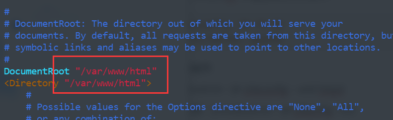

# 配置主机环境记录

主机系统类型：Linux Centos 7


## 指令安装

上传rz、下载sz

```powershell
[root@localhost Packages]# yum install lrzsz
```


## Apache

### 下载相关包

1. **Apache HTTP Server**

2.  **APR 和 APR-Util包**

   http://apr.apache.org/download.cgi

3. **PCRE包**

   https://sourceforge.net/projects/pcre/files/pcre/


### 安装过程

#### Step1：安装gcc或gcc-c++

```powershell
[root@getlnx05 pcre-8.33]# yum list gcc-c++
Loaded plugins: product-id, security, subscription-manager
Updating Red Hat repositories.
Available Packages
gcc-c++.x86_64                                                               4.1.2-51.el5                                                                rhel-debuginfo
[root@getlnx05 pcre-8.33]# yum list gcc
Loaded plugins: product-id, security, subscription-manager
Updating Red Hat repositories.
Installed Packages
gcc.x86_64                                                                    4.1.2-51.el5                                                                    installed
[root@getlnx05 pcre-8.33]# rpm -q gcc
gcc-4.1.2-51.el5

#从上面可见gcc包已经安装，缺少gcc-c++包，那么接下来安装包gcc-c++,如果此处不安装该包，后面安装过程中会报错。（编译C）

[root@getlnx05 pcre-8.33]#yum install  gcc-c++
```


#### Step2：安装APR、APR-Util和PCRE

先将两个包放在主机的普通的目录中，然后：

```powershell
[root@getlnx05 kerry]# tar -zxvf apr-1.4.8.tar.gz
[root@getlnx05 kerry]# cd apr-1.4.8
[root@getlnx05 apr-1.4.8]# mkdir /usr/local/apr
[root@getlnx05 apr-1.4.8]# ./configure --prefix=/usr/local/apr
[root@getlnx05 apr-1.4.8]# make
[root@getlnx05 apr-1.4.8]# make install

[root@getlnx05 kerry]# tar -zxvf apr-util-1.5.2.tar.gz
[root@getlnx05 kerry]# cd apr-util-1.5.2
[root@getlnx05 apr-util-1.5.2]# mkdir /usr/local/apr-util
[root@getlnx05 apr-util-1.5.2]# ./configure --prefix=/usr/local/apr-util --with-apr=/usr/local/apr/bin/apr-1-config
[root@getlnx05 apr-util-1.5.2]# make
[root@getlnx05 apr-util-1.5.2]# make install

[root@getlnx05 kerry]# unzip pcre-8.33.zip
[root@getlnx05 kerry]# cd pcre-8.33
[root@getlnx05 pcre-8.33]# mkdir /usr/local/pcre
[root@getlnx05 pcre-8.33]# ./configure --prefix=/usr/local/pcre --with-apr=/usr/local/apr/bin/apr-1-config
[root@getlnx05 pcre-8.33]# make
[root@getlnx05 pcre-8.33]# make install
```


#### Step3：安装Apache

同样，先将包上传至主机，然后：

```powershell
root@getlnx05 kerry]# tar -zxvf httpd-2.4.6.tar.gz
[root@getlnx05  kerry]# cd httpd-2.4.6
[root@getlnx05 httpd-2.4.6]# ./configure --prefix=/usr/local/apache --with-pcre=/usr/local/pcre --with-apr=/usr/local/apr --with-apr-util=/usr/local/apr-util
[root@getlnx05 httpd-2.4.6]# make
[root@getlnx05 httpd-2.4.6]# make install
```


#### Step4：启动Apache服务

```powershell
[root@getlnx05 httpd-2.4.6]#  /usr/local/apache/bin/apachectl start
```

用浏览器访问 **http://主机号** 时提示It works!


#### Step5：配置环境变量

1. 在"/etc/profile"文件最后添加export PATH=$PATH:/usr/local/apache/bin　（"="左右不要有空格）

2. [root@admin ~]# source /etc/profile　（立即生效）

3. 测试重启：[root@admin ~]# service httpd restart


#### Step6：设置开机启动

1. [root@admin ~]# cp　/usr/local/apache/bin/apachectl　/etc/rc.d/init.d/httpd   

（如果有其他的版本的Apache存在，也可以直接覆盖掉）

2. 打开编辑（vim，键盘输入字母"i"）"/etc/rc.d/init.d/httpd"文件，在 #!/bin/sh 下增加两行文字如下：

```shell
　　# chkconfig: 35 70 30
　　# description: Apache
```

3. 注册该服务

   [root@admin ~]# chkconfig –-add httpd

   查看结果：[root@admin ~]# chkonfig --list


#### Step7：配置默认站点根目录

1. 打开 /usr/local/apache/conf/httpd.conf，修改内容如下：



2. 创建 /var/www/html 文件夹，并放入相关的静态网页
3. [root@localhost super]# httpd -t #检查配置文件 
4. [root@localhost super]# systemctl restart httpd.service 
5. 打开浏览器预览


## JAVA

### 下载相关包

https://www.oracle.com/java/technologies/javase/javase-jdk8-downloads.html


### 安装过程

#### Step1：创建目录

```powershell
[root@iZwz99gbay10w3vab4b2zkZ package]# mkdir -p /usr/local/java1.8
[root@iZwz99gbay10w3vab4b2zkZ package]# cd /usr/local/java1.8/
```


#### Step2：上传jdk并解压

```powershell
[root@iZwz99gbay10w3vab4b2zkZ java1.8]# tar -zxvf jdk-8u261-linux-x64.tar.gz 
```


#### Step3：配置环境变量

打开 /etc/profile，添加以下

```shell
export JAVA_HOME=/usr/local/java1.8/jdk1.8.0_261
export JRE_HOME=${JAVA_HOME}/jre
export CLASSPATH=.:${JAVA_HOME}/lib:${JRE_HOME}/lib
export PATH=${JAVA_HOME}/bin:$PATH
```

然后刷新执行

```powershell
[root@iZwz99gbay10w3vab4b2zkZ java1.8]# source /etc/profile
```


#### Step4：添加软连接

```powershell
[root@iZwz99gbay10w3vab4b2zkZ java1.8]# ln -s /usr/local/java1.8/jdk1.8.0_261/bin/java /usr/bin/java
```


#### Step5：检测

```powershell
[root@iZwz99gbay10w3vab4b2zkZ java1.8]# java -version
java version "1.8.0_261"
Java(TM) SE Runtime Environment (build 1.8.0_261-b12)
Java HotSpot(TM) 64-Bit Server VM (build 25.261-b12, mixed mode)
```


## MySQL

### 下载相关包

```powershell
[root@iZwz99gbay10w3vab4b2zkZ package]# wget -i -c http://dev.mysql.com/get/mysql57-community-release-el7-10.noarch.rpm
[root@iZwz99gbay10w3vab4b2zkZ package]# yum -y install mysql57-community-release-el7-10.noarch.rpm
```


### 安装过程

#### Step1：安装MySQL

```powershell
[root@iZwz99gbay10w3vab4b2zkZ package]# yum -y install mysql-community-server
```


#### Step2：开启服务并设置密码

开启服务：

```powershell
[root@iZwz99gbay10w3vab4b2zkZ package]# systemctl start mysqld.service
```

查看运行状态：

```powershell
[root@iZwz99gbay10w3vab4b2zkZ package]# systemctl status mysqld.service
● mysqld.service - MySQL Server
   Loaded: loaded (/usr/lib/systemd/system/mysqld.service; enabled; vendor preset: disabled)
   Active: active (running) since Thu 2020-09-17 21:51:30 CST; 21s ago
     Docs: man:mysqld(8)
           http://dev.mysql.com/doc/refman/en/using-systemd.html
  Process: 9483 ExecStart=/usr/sbin/mysqld --daemonize --pid-file=/var/run/mysqld/mysqld.pid $MYSQLD_OPTS (code=exited, status=0/SUCCESS)
  Process: 9434 ExecStartPre=/usr/bin/mysqld_pre_systemd (code=exited, status=0/SUCCESS)
 Main PID: 9486 (mysqld)
   CGroup: /system.slice/mysqld.service
           └─9486 /usr/sbin/mysqld --daemonize --pid-file=/var/run/mysqld/mysq...
Sep 17 21:51:25 iZwz99gbay10w3vab4b2zkZ systemd[1]: Starting MySQL Server...
Sep 17 21:51:30 iZwz99gbay10w3vab4b2zkZ systemd[1]: Started MySQL Server.
```

此时MySQL已经开始正常运行，不过要想进入MySQL还得先找出此时root用户的密码，通过如下命令可以在日志文件中找出密码：

```powershell
[root@iZwz99gbay10w3vab4b2zkZ package]# grep "password" /var/log/mysqld.log
2020-09-17T13:51:27.725025Z 1 [Note] A temporary password is generated for root@localhost: VoQamPu-3#uh
```

使用root和这个密码进入mysql后，进行密码的修改：

```mysql
mysql> ALTER USER 'root'@'localhost' IDENTIFIED BY 'new password';
```

其中‘new password’替换成你要设置的密码，注意:密码设置必须要大小写字母数字和特殊符号（,/';:等）,不然不能配置成功


#### Step3：开启远程访问

命令开启的IP是 192.168.0.1，如要开启所有的，用%代替IP）：

```mysql
mysql> grant all privileges on *.* to 'root'@'192.168.0.1' identified by 'password' with grant option;
mysql> flush privileges;
mysql> exit
```


#### Step4：为firewalld添加开放端口

添加mysql端口3306和Tomcat端口8080

```powershell
[root@iZwz99gbay10w3vab4b2zkZ package]# firewall-cmd --zone=public --add-port=3306/tcp --permanent
success
[root@iZwz99gbay10w3vab4b2zkZ package]# firewall-cmd --zone=public --add-port=8080/tcp --permanent
success
[root@iZwz99gbay10w3vab4b2zkZ package]# firewall-cmd --reload
success
```


#### Step5：更改mysql的语言

登录mysql，然后输入status，可以发现：

```
Server characterset:    latin1
Db     characterset:    latin1
```

并不是utf8mb4，因此先退出mysql

打开 /etc/my.cnf，添加/修改以下内容：

```
[client]
default-character-set = utf8mb4
[mysql]
default-character-set = utf8mb4
[mysqld]
character-set-client-handshake = FALSE
character-set-server = utf8mb4
collation-server = utf8mb4_unicode_ci
init_connect='SET NAMES utf8mb4'
```

然后重启mysql：

```powershell
[root@iZwz99gbay10w3vab4b2zkZ etc]# service mysqld restart
```

登录mysql检查：

```mysql

mysql> SHOW VARIABLES WHERE Variable_name LIKE 'character%' OR Variable_name LIKE 'collation%';
+--------------------------+----------------------------------+
| Variable_name            | Value                            |
+--------------------------+----------------------------------+
| character_set_client     | utf8mb4                          |
| character_set_connection | utf8mb4                          |
| character_set_database   | utf8mb4                          |
| character_set_filesystem | binary                           |
| character_set_results    | utf8mb4                          |
| character_set_server     | utf8mb4                          |
| character_set_system     | utf8                             |
| character_sets_dir       | /usr/local/mysql/share/charsets/ |
| collation_connection     | utf8mb4_unicode_ci               |
| collation_database       | utf8mb4_unicode_ci               |
| collation_server         | utf8mb4_unicode_ci               |
+--------------------------+----------------------------------+
```


## Tomcat

### 下载相关包

http://tomcat.apache.org/。选择版本在左侧，使用的是Core（核心）里的。


### 安装过程

#### Step1：解压到特定位置

```powershell
[root@iZwz99gbay10w3vab4b2zkZ package]# tar zxf apache-tomcat-9.0.38.tar.gz -C /usr/local/
[root@iZwz99gbay10w3vab4b2zkZ package]# mv /usr/local/apache-tomcat-9.0.38/ /usr/local/tomcat9.0
```


#### Step2：开机自启

创建一个启动脚本：

```shell
[root@iZwz99gbay10w3vab4b2zkZ java1.8]# vim /etc/init.d/tomcat

#!/bin/bash
#
#tomcat startup script for the Tomcat server
#
# chkconfig: 345 80 20
# description: start the tomcat deamon
#
# Source function library
JAVA_HOME=/usr/local/java1.8/jdk1.8.0_261
export JAVA_HOME
CATALANA_HOME=/usr/local/tomcat9.0
export CATALANA_HOME
case "$1" in
start)
    echo "Starting Tomcat..."
    $CATALANA_HOME/bin/startup.sh
    ;;
stop)
    echo "Stopping Tomcat..."
    $CATALANA_HOME/bin/shutdown.sh
    ;;
restart)
    echo "Stopping Tomcat..."
    $CATALANA_HOME/bin/shutdown.sh
    sleep 2
    echo
    echo "Starting Tomcat..."
    $CATALANA_HOME/bin/startup.sh
    ;;
*)
    echo "Usage: $prog {start|stop|restart}"
    ;;
esac
exit 0
```

加入开机自启：

```powershell
[root@iZwz99gbay10w3vab4b2zkZ ~]# chmod +x /etc/init.d/tomcat
[root@iZwz99gbay10w3vab4b2zkZ ~]# chkconfig --add tomcat
[root@iZwz99gbay10w3vab4b2zkZ ~]# chkconfig --list tomcat

Note: This output shows SysV services only and does not include native
      systemd services. SysV configuration data might be overridden by native
      systemd configuration.

      If you want to list systemd services use 'systemctl list-unit-files'.
      To see services enabled on particular target use
      'systemctl list-dependencies [target]'.

tomcat          0:off   1:off   2:off   3:on    4:on    5:on    6:off
```


#### Step3：启动

```powershell
[root@iZwz99gbay10w3vab4b2zkZ ~]# systemctl start tomcat
[root@iZwz99gbay10w3vab4b2zkZ ~]# systemctl status tomcat
● tomcat.service - SYSV: start the tomcat deamon
   Loaded: loaded (/etc/rc.d/init.d/tomcat; bad; vendor preset: disabled)
   Active: active (running) since Thu 2020-09-17 22:44:04 CST; 7s ago
     Docs: man:systemd-sysv-generator(8)
  Process: 9819 ExecStart=/etc/rc.d/init.d/tomcat start (code=exited, status=0/SUCCESS)
   CGroup: /system.slice/tomcat.service
           └─9828 /usr/local/java1.8/jdk1.8.0_261/bin/java -Djava.util.logging...
Sep 17 22:44:04 iZwz99gbay10w3vab4b2zkZ systemd[1]: Starting SYSV: start the t...Sep 17 22:44:04 iZwz99gbay10w3vab4b2zkZ tomcat[9819]: Starting Tomcat...
Sep 17 22:44:04 iZwz99gbay10w3vab4b2zkZ tomcat[9819]: Tomcat started.
Sep 17 22:44:04 iZwz99gbay10w3vab4b2zkZ systemd[1]: Started SYSV: start the to...Hint: Some lines were ellipsized, use -l to show in full.
```

注意：记得开启8080端口（安装MySQL中有涉及，这里不进行赘述），然后还需要去阿里云的安全组那里修改一下规则，添加8080开放


## Maven

### 下载相关包

https://maven.apache.org/download.cgi

本次下载的是 apache-maven-3.6.3-bin.tar.gz


### 安装过程

#### Step1：安装到特定位置

```powershell
[root@iZwz99gbay10w3vab4b2zkZ package]# tar zxf apache-maven-3.6.3-bin.tar.gz -C /usr/local/
[root@iZwz99gbay10w3vab4b2zkZ package]# mv /usr/local/apache-maven-3.6.3/ /usr/local/maven3.6
```


#### Step2：设置环境变量

打开 /etc/profile，添加以下内容：

```shell
MAVEN_HOME=/usr/local/maven3
export MAVEN_HOME
export PATH=${PATH}:${MAVEN_HOME}/bin
```

保存然后更新：

```powershell
[root@iZwz99gbay10w3vab4b2zkZ package]# source /etc/profile
```

测试：

```powershell
[root@iZwz99gbay10w3vab4b2zkZ package]# mvn -version
Apache Maven 3.6.3 (cecedd343002696d0abb50b32b541b8a6ba2883f)
Maven home: /usr/local/maven3.6
Java version: 1.8.0_261, vendor: Oracle Corporation, runtime: /usr/local/java1.8/jdk1.8.0_261/jre
Default locale: en_US, platform encoding: UTF-8
OS name: "linux", version: "3.10.0-1062.18.1.el7.x86_64", arch: "amd64", family: "unix"
```

