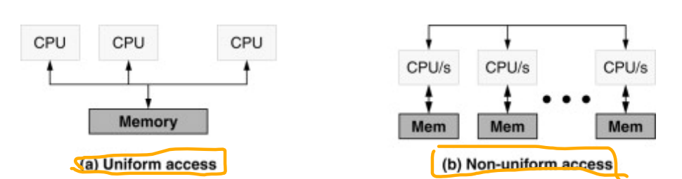

# MongoDB

## 在Linux上安装MongoDB首次进入提示NUMA machine

```a
WARNING: You are running on a NUMA machine.
We suggest launching mongod like this to avoid performance problems:
numactl --interleave=all mongod [other options]
```

什么是NUMA？它是一种存储访问的架构，UMA和NUMA一对相对的概念。

> A NUMA architecture
> is one in which all memory accesses have nominally the same latency; a NUMA
> architecture is one in which references to different addresses may have different
> latencies due to the nature of where the data is stored. 
> 
> [Logical Organization Bruce Jacob, ... David T. Wang, in Memory Systems, 2008]()

而MongoDB的性能在NUMA上运作时很低：

> **Disable NDisable NUMA**, Running MongoDB on a system with Non-Uniform Access Memory (NUMA) can cause anumber of operational problems, including slow performance for periods of time and high system process usage. When running MongoDB servers and clients on NUMA hardware, you should configure a memory interleave policy so that the host behaves in a non-NUMA fashion.
> [Performance Best Practices forMongoDB June 2018 A MongoDB White Paper]()

所以按照要求使用`numactl --interleave=all mongod --config /etc/mongodb.conf`来启动，如果没有`numactl`就安装一个。

### 但使用numactl --interleave=all mongod --config /ect/mongodb.conf启动MongoDB报错exception in initAndListen: 10309 Unable to create/open lock file: /data/db/mongod.lock errno:13 Permission denied Is a mongod instance already running? 且 couldn't remove fs lock errno:9 Bad file descriptor

首先按照[Stack Overflow上的回答](https://stackoverflow.com/questions/15229412/unable-to-create-open-lock-file-data-mongod-lock-errno13-permission-denied)进行了一波努力：

1. 修改`/data/db`的权限，使用指令`sudo chown -R mongodb:mongodb /data/db/`
2. 再次启动还是不好使，于是改变了log的位置，改成`/log/mongodb/`，然后修改了此文件夹的权限，使用指令`sudo chown -R mongodb:mongodb /log/mongodb/`
3. 再次启动还是不好使
4. 思来想去可能还是因为权限不够，虽然mongodb有权限，但是numactl没有，所以在指令前面加上了`sudo`，不在报错
5. 注意要保证mongodb已经stop了再执行这条指令

再次使用`mongo`进入交互界面，不再提示Waring:You are running on a NUMA machine....

## 启动MongoDB报错ERROR: dbpath (/data/db) does not exist.

修改`/etc/mongodb.conf`中的数据目录并新建一个。

## 使用mongoimport导入jsonArray时报错，但没有具体提示

向mongodb中导入jsonArray文件只需要在cmd里输入指令：

```shell
mongoimport --db weibo --collection stockNotice --file stockNotice.json
如果是jsonArray格式的(最外面是[])：
mongoimport --db weibo --collection stockNotice --jsonArray --file stockNotice.json
```

但使用导入jsonArray命令的时候报了错：

```a
2020-10-16T01:35:33.715+0800 check 0 0
2020-10-16T01:35:33.715+0800 imported 0 objects
encountered 1 error(s)
```

除此之外没有提示。

这是因为：

> --jsonArray
> Accepts the import of data expressed with multiple MongoDB documents within a single JSON array. Limited to imports of 16 MB or smaller.
> mongoimport的文档：https://docs.mongodb.com/database-tools/mongoimport/#bin.mongoimport

解决办法：

jsonArray格式的是这样的：

```json
[{"obj":1},
{"obj":2},
{"obj":3}]
```

只需要改成这样的：


```json
{"obj":1}
{"obj":2}
{"obj":3}
```

并且去掉--jsonArray参数即可。
